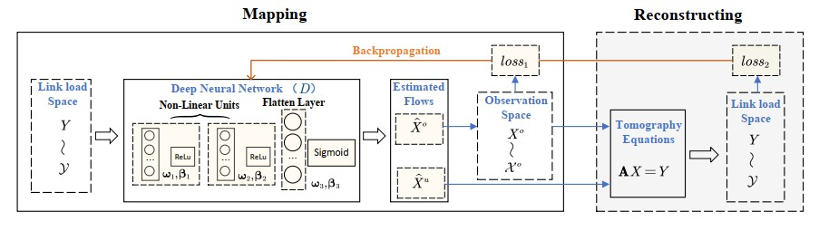
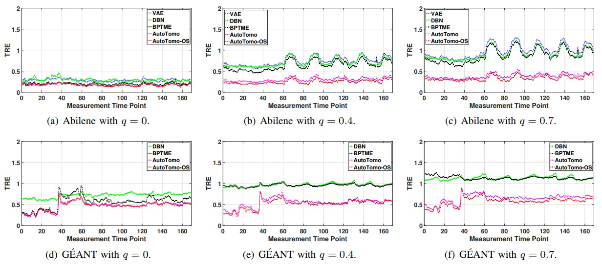
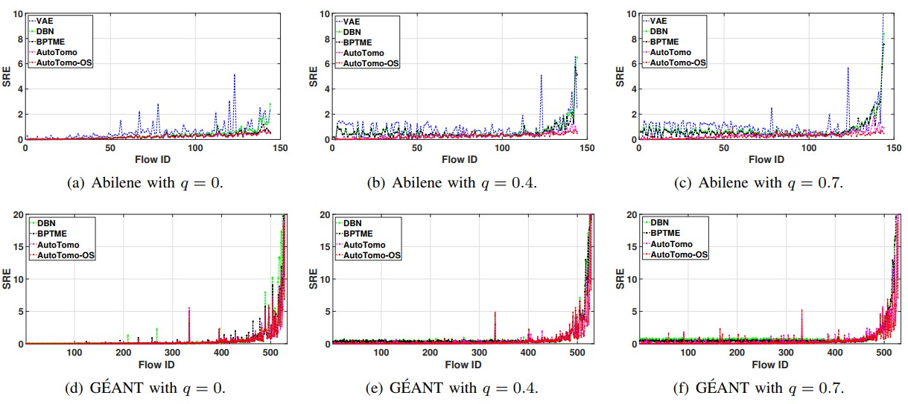

# [IEEE/ACM TON] Official Implementation: "AutoTomo: Learning-Based Traffic Estimator Incorporating Network Tomography"

<div align="center">

<p>


</p>

</div>

<p>
Official implementation of "AutoTomo: Learning-Based Traffic Estimator Incorporating Network Tomography".
</p>

## Abstract

> Estimating the Traffic Matrix (TM) is a critical yet resource-intensive process in network management. With the advent of deep learning models, we now have the potential to learn the inverse mapping from link loads to origin-destination (OD) flows more efficiently and accurately. However, a significant hurdle is that all current learning-based techniques necessitate a training dataset covering a comprehensive TM for a specific duration. This requirement is often unfeasible in practical scenarios. This paper addresses this complex learning challenge, specifically when dealing with incomplete and biased TM data. 

<p align="center">

<br>
<b>Figure 1.</b> The architecture of AutoTomo.
</p>

> Our initial approach involves parameterizing the unidentified flows, thereby transforming this problem of target-deficient learning into an empirical optimization problem that integrates tomography constraints. Following this, we introduce AutoTomo, a learning-based architecture designed to optimize both the inverse mapping and the unexplored flows during the model’s training phase. We also propose an innovative observation selection algorithm, which aids network operators in gathering the most insightful measurements with limited device resources. We evaluate AutoTomo with three public traffic datasets Abilene, CERNET
and GÉANT. The results reveal that AutoTomo outperforms four state-of-the-art learning-based TM estimation techniques. With complete training data, AutoTomo enhances the accuracy of the most efficient method by 15%, while it shows an improvement between 30% to 53% with incomplete training data. Furthermore, AutoTomo exhibits rapid testing speed, making it a viable tool for real-time TM estimation.

## Requirements

1. Install Python 3.8, and the required dependencies.
2. Required dependencies can be installed by: ```pip install -r requirements.txt```

## File Structure

- data_utils.py - preprocess CSV file and custom dataset loader for experimentation.
- main.py - main function with args settings.
- plot_utils.py - helper functions for generating figures. 
- train_utils.py - code for earlystopping, training and testing.
- net_params.py - network architectures of AutoTomo, AutoTomo-os, BPNN and DBN.
- Data/Abilene/ - CSV files of routing martrix and traffic matrices sampled from Abilene network.
- Data/GEANT/ - CSV files of routing martrix and traffic matrices sampled from GÉANT network.
- Data/CERNET/ - CSV files of routing martrix and traffic matrices sampled from CERNET network.

## How to Run

```bash
python main.py --model autotomo --unknown_rate 0.1 --dataset geant --loss_func l1norm --mode unobserved --epoch 1500
```

## Main Results

### Temporal Related Mean Absolute Error (TRE)

<p align="center">

<br>
<b>Figure 2.</b> Temporal estimation errors on three unknown rates.
</p>

### Spatial Related Mean Absolute Error (SRE)

<p align="center">

<br>
<b>Figure 3.</b> Spatial estimation errors on three unknown rates.
</p>

## Authors

- [Yan Qiao](http://faculty.hfut.edu.cn/qiaoyan/en/index.htm) -  [qiaoyan@hfut.edu.cn](qiaoyan:qiaoyan@hfut.edu.cn)
- [Xinyu Yuan](https://y-debug-sys.github.io/) - [yxy5315@gmail.com](yuanxinyu:yxy5315@gmail.com)

## Licence

Distributed under the Apache-2.0 License. See [LICENCE](https://github.com/duoduoqiao/AutoTomo/blob/main/LICENSE) for more information.

## Acknowledgements
The CERNET dataset used for validating AutoTomo relies on resources from https://github.com/THU-INSC-NAD/Traffic-Matrix-Prediction, we thank the original authors for open-sourcing their work.

<!-- ## FAQs -->

## Citation

If you find this work useful in your research, please kindly cite our paper:

```
@ARTICLE{10589439,
  author={Qiao, Yan and Wu, Kui and Yuan, Xinyu},
  journal={IEEE/ACM Transactions on Networking}, 
  title={AutoTomo: Learning-Based Traffic Estimator Incorporating Network Tomography}, 
  year={2024},
  volume={},
  number={},
  pages={1-16},
  keywords={Estimation;Accuracy;Training;Load modeling;Training data;Volume measurement;Transforms;Traffic estimation;deep learning;learning with missing data;network tomography},
  doi={10.1109/TNET.2024.3424446}}
```
